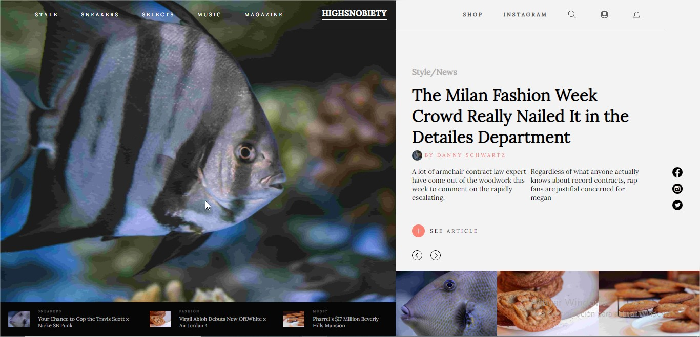

# JavaScript Carrousel App

In this project I created a simple carrousel app.

## Built With

- HTML5 
- Sass
- JavaScript
- webpack 3
- npm

## Live Demo

[Live Demo Link](https://rawcdn.githack.com/bruna-genz/todo-list/261fbc6ced78de846890be0e6197e822e24b3f57/dist/index.html)

## Getting Started

Download or clone the project [here](https://github.com/bruna-genz/restaurant-page.git), then enter in the project's directory from the terminal and run the following comands:
- `npm i`
- `npm run start`

## Authors

:man: **Nicolás Mariño Parra**

- Github: [@nicolasmarino99](https://github.com/nicolasmarino99)
- Twitter: [@nicolasmarino99](https://twitter.com/nicolasmarino99)
- Linkedin: [Nicolás Mariño Parra](https://www.linkedin.com/in/nicol%C3%A1s-mari%C3%B1o-parra-45a707177/)

## 🤝 Contributing

Contributions, issues and feature requests are welcome!

## Show your support

Give a ⭐️ if you like this project!

